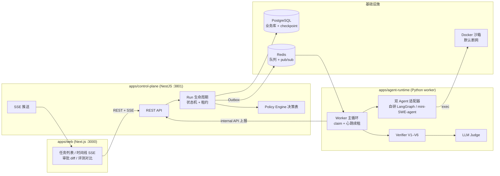
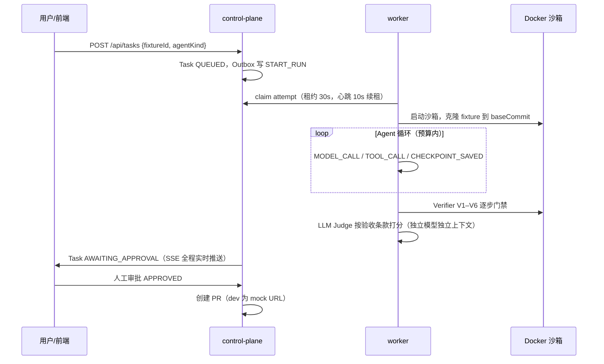

# Agent Reliability & Governance Platform

<p>
  <a href="https://github.com/Endorphin20/agent-reliability-platform/actions/workflows/ci.yml"></a>
  
  
  
  
  
  
</p>

面向 CI/CD 场景的**可观测、可评测、可恢复**代码诊断与修复 Agent 平台。

一句话：把"Agent 修 bug"从黑盒脚本变成有事件溯源、有六步门禁、有 LLM 评审、
崩了能从 checkpoint 续跑、还能拿真实基准做 A/B 评测的工程系统。

> **未生产化声明**：本项目是可靠性工程能力的展示型实现。鉴权/多租户/水平扩展等
> 生产要素做了明确裁剪（详见 [docs/architecture.md](docs/architecture.md) 的边界一节）。
> 沙箱逃逸防护依赖 Docker 默认隔离，不承诺对抗恶意负载。

## 为什么做这个

让 Agent 自动修 bug 不难，难的是把它变成**敢放进 CI/CD 的工程系统**。裸跑 Agent 脚本有四个致命问题：

1. **黑盒**——中间发生了什么没人知道，失败了无从排查；
2. **脆弱**——沙箱崩了、worker 挂了、模型 429 了，只能整单重跑，前面花的 token 全部沉没；
3. **不可信**——补丁改没改测试作弊？改动越界了吗？回归过了吗？没有门禁；
4. **无法比较**——换个 Agent、换个反馈策略，效果好坏全凭感觉，没有可复现实验。

本平台针对这四个问题分别给出工程化答案：事件溯源 + SSE 时间线、Policy 驱动的 checkpoint 恢复、V1–V6 Verifier 门禁 + LLM Judge + 人工审批、`arp-eval` 评测 CLI 与消融实验。

## 核心能力

| 能力 | 实现 |
| --- | --- |
| 可观测 | 15 类 TraceEvent 事件溯源（MODEL_CALL / TOOL_CALL / CHECKPOINT_SAVED / RECOVERY_ACTION…），Run 级严格递增 sequence（DB 唯一约束 + 事务内分配），worker 上报带 idempotencyKey 保证重放不重复，SSE 实时推送到前端时间线 |
| 可恢复 | 三种故障注入（kill 沙箱 / kill worker / 模型 429）全部自动恢复：租约心跳判活、Policy 决策表（RESUME/RETRY/ESCALATE/ABORT）、LangGraph PostgresSaver checkpoint 续跑、已完成工具调用幂等缓存（`cached=true`） |
| 可评测 | `arp-eval` CLI 跑批：12 个自建金标 fixture + **SWE-bench Lite 12 实例子集**（django/sympy 真实历史 bug，基准 test_patch 对 Agent 不可见）；双 Agent 对比、故障注入 ± 恢复消融、反馈模式消融；LLM Judge（独立模型 claude-opus-4-6）按验收条款逐条打分 |
| 可治理 | V1–V6 六步 Verifier 门禁（补丁形态/改动范围/静态检查/定向测试/回归测试/作弊检测）+ 人工审批后才建 PR |
| CI 闭环 | GitHub webhook（HMAC 验签）issue 评论 `/arp run <fixtureId>` 触发任务 → Agent 修复 → 审批通过 → 推 `agent-fix/*` 分支并创建**真实 GitHub PR**（幂等重试），出入站全链路实测 |

## 架构总览

控制面只做**编排**（状态机、租约、Policy、审批、评测聚合），执行面只做**干活**（Agent、沙箱、Verifier、Judge），二者只通过 HTTP internal API 和 Redis 队列交互——worker 可随时被杀掉重启，这正是恢复能力的前提。



```
apps/web            Next.js 前端：任务列表 / 运行时间线 / 审批 diff / 评测对比
apps/control-plane  NestJS 控制面：任务生命周期、租约、Policy Engine、审批、SSE、评测 API
apps/agent-runtime  Python worker：双 Agent 适配器、Docker 沙箱、Verifier、LLM Judge、arp-eval
packages/shared     TS/Python 双端契约：zod schema + JSON Schema + 契约测试 fixture
infra/sandbox       arp-sandbox 镜像（node + python + uv，默认断网）
scripts/e2e.sh      端到端验收：主链路 + 三种故障恢复 + smoke 评测一次跑通
```

详细设计（完整架构图 + 事件流时序 + 恢复时序）见 [docs/architecture.md](docs/architecture.md)。

## 一次修复任务的生命周期



## 故障注入与自动恢复

平台内置三种故障注入方式，全部走 Policy 决策表自动恢复：

| 注入方式 | 触发 | 恢复路径 |
| --- | --- | --- |
| kill-sandbox | 首个 checkpoint 后 `docker rm -f` 沙箱 | SANDBOX_CRASHED → RESUME → checkpoint 续跑 |
| kill-worker | 第 2 个 checkpoint 后 `os._exit(137)` 或直接杀进程 | 租约过期 → WORKER_LOST → 新 worker RESUME |
| model-429 | 第 3 次模型调用抛一次 429 | MODEL_RATE_LIMIT → 指数退避 RESUME |

恢复的关键机制：

- **租约判活**：worker 30s 租约 + 10s 心跳，进程死亡秒级被发现；
- **Policy 决策表**：按 failureCode 决定 RESUME / RESTART_ATTEMPT / ESCALATE_HUMAN / ABORT，越界改动和测试篡改直接重开或终止；
- **checkpoint 续跑**：LangGraph PostgresSaver 恢复完整对话状态，悬空 tool_calls 补占位消息；
- **幂等缓存**：新沙箱重建工作区时重放 completedToolCalls，命中缓存的调用打 `cached=true` 跳过执行——**从中断点继续，而非从零重跑**。

## 评测体系与实验结论

`arp-eval` CLI 一条命令跑批，每个 run 输出解决率 / tokens / 耗时 / 成本 / Judge 分。六组实验的完整数据与勘误见 [docs/experiment-report.md](docs/experiment-report.md)，关键结论：

**实验一 · 双 Agent 对比**（12 个自建金标 fixture）：自研 LangGraph 与 mini-SWE-agent 解决率打平（12/12），mini-SWE 纯 bash 循环省约 40% tokens；自研换来的是 checkpoint 级可恢复性——"可靠性税"的直观定价。

**实验二 · 恢复机制消融**（同为 kill-sandbox 注入）：

| 指标 | 开恢复（RESUME） | 禁恢复（全 ABORT） |
| --- | --- | --- |
| 解决率 | **12/12 (100%)** | **0/12 (0%)** |
| 总成本 | $0.45（比无故障基线只多 12%） | $0.30（全部沉没） |

**实验三 · 反馈模式消融**：结构化反馈（失败分类 + 定位建议）比裸贴原始输出省约 19% tokens / 24% 成本。

**实验四 · SWE-bench Lite 12 实例子集**（django + sympy 真实历史 bug）：mini-SWE 9/12 vs 自研 v1 6/12——真实基准把两个 Agent 拉开了，自建 fixture 上看不出的探索效率差距在大仓库上直接吃掉解决率。36 个 run 越界改动均为 0，V6 防篡改 + test_patch 不可见的组合下无一作弊。

**实验五 · 失败分析驱动的 Agent v2**（[docs/failure-analysis.md](docs/failure-analysis.md)）：对 6 个失败 run 做事件流 + checkpoint 取证，归因出两个平台缺陷（guard 白名单挡死合法测试命令、read_file 全文回读导致上下文膨胀）；修复后同配置重跑 **50% → 83%（10/12），反超 mini-SWE 且成本降 34%**——事件溯源让 Agent 迭代成为可复现实验，取证到验证一个工作日闭环。

**实验六 · 双 worker 并发**（`scripts/multi-worker-demo.sh`）：6 并发任务两 worker 均分零双重认领；`kill -9` 持有者后租约过期 → WORKER_LOST → 幸存 worker 从 checkpoint 接管跑到成功。

**实验七 · 重复性检验**（fixture-12 × 3 轮）：解决率 / 首试成功率 / Judge 分三轮零方差，tokens 波动约 13%（模型采样噪声）——报告中小于此量级的 token 差距不做解读。

> 诚实口径：子集仅 12 个筛选后实例，解决率不可与官方 SWE-bench Lite 排行榜横比；其价值在于验证平台能承接外部真实基准，并提供更有区分度的 A/B 信号。

## 环境矩阵

| 依赖 | 版本 | 用途 |
| --- | --- | --- |
| Node.js / pnpm | ≥ 20 / ≥ 11 | control-plane、web、shared |
| Python / uv | ≥ 3.12 | agent-runtime worker 与 arp-eval |
| Docker | ≥ 24 | postgres/redis（compose）+ 沙箱容器 |
| PostgreSQL | 16（容器） | 业务库 + LangGraph checkpoint |
| Redis | 7（容器） | run-commands 队列 + SSE pub/sub |
| LLM 端点 | OpenAI 兼容 | Agent 用 `gpt-5.5`，Judge 用 `claude-opus-4-6`（可换） |

## 快速开始

```bash
# 0) 依赖：docker、pnpm、uv、jq；克隆本仓库和同级的 agent-fixture-repo
docker compose up -d --wait

# 1) 安装 + 迁移
pnpm install
pnpm -C apps/control-plane exec prisma migrate deploy
docker build -t arp-sandbox:latest infra/sandbox

# 2) 配置 LLM（apps/agent-runtime/.env，参考 .env.example）
#    LLM_MODEL=gpt-5.5  JUDGE_LLM_MODEL=claude-opus-4-6  LLM_API_KEY=...

# 3) 起三个进程
pnpm -C apps/control-plane start:dev                       # 控制面 :3801
(cd apps/agent-runtime && uv run python -m arp_runtime.worker)  # worker
pnpm -C apps/web dev                                       # 前端 :3000

# 4) 创建一个修复任务（也可以在前端页面点"新建任务"）
curl -X POST localhost:3801/api/tasks -H 'Content-Type: application/json' \
  -d '{"fixtureId":"py-logic-001","agentKind":"SELF_LANGGRAPH"}'
```

打开 http://localhost:3000 看时间线实时增长；跑完进入审批页核对 diff + Judge 评分。

## 一键验收与评测

```bash
bash scripts/e2e.sh          # 端到端验收（主链路 + 3 种故障恢复 + smoke 评测），退出码 0 即通过

cd apps/agent-runtime        # 完整评测（命令与结论见 docs/experiment-report.md）
uv run arp-eval run --suite fixture-12 --agent self
uv run arp-eval run --suite fixture-12 --agent mini-swe
uv run arp-eval run --suite fixture-12 --agent self --fault-inject kill-sandbox
uv run arp-eval run --suite fixture-12 --agent self --fault-inject kill-sandbox --no-recovery
uv run arp-eval run --suite fixture-12 --agent self --fault-inject kill-sandbox --feedback raw
uv run arp-eval report       # 汇总表
```

### SWE-bench Lite 子集

```bash
# 一次性准备：克隆上游仓库 + 从 Lite 数据集生成 swb-* fixture + 金标验证
git clone https://github.com/django/django.git ~/Coding/agent-reliability/swebench-repos/django
git clone https://github.com/sympy/sympy.git  ~/Coding/agent-reliability/swebench-repos/sympy
cd apps/agent-runtime
uv run --with pyarrow --with pyyaml python ../../scripts/swebench_import.py   # 生成 fixture
uv run --with pyyaml python ../../scripts/swebench_validate.py               # 金标补丁必须全过

# 评测（预算自动放宽到 400k tokens / 2400s / 50 轮）
uv run arp-eval run --suite swebench --agent self
uv run arp-eval run --suite swebench --agent mini-swe
```

入集资格 = 金标验证三步全过：修复前 FAIL_TO_PASS 必失败 → 官方 gold patch 后必通过 → PASS_TO_PASS 必通过。基准 test_patch 对 Agent 全程不可见，由 Verifier 在跑测试前应用、跑完立即回滚，防作弊且回炉不误报。

## 安全与治理

- **沙箱**：默认 `network=none`，CPU/内存限额，attempt 结束即销毁，worker 启动清扫孤儿容器；
- **命令白名单**：`run_command` 仅允许 pnpm/node/python/pytest 等前缀，denylist 拦截 curl/ssh/sudo/rm -rf；
- **Verifier V1–V6**：补丁良构 → 范围合规（allowedPaths glob）→ 静态检查 → 定向测试 → 回归测试 → 测试防篡改（短路提前跑）；
- **LLM Judge 只参考不否决**：独立模型独立上下文按 acceptance_criteria 逐条 0–5 打分，进审批页辅助人工决策；
- **人工审批**：AWAITING_APPROVAL → APPROVED 才触发 PR 创建。

## 测试

```bash
pnpm -r test                                     # web / control-plane / shared（含双端契约测试）
(cd apps/agent-runtime && uv run python -m pytest)
```

`packages/shared` 同时产出 zod schema（TS）与 JSON Schema（Python pydantic 校验），同一批 JSON fixture 被两端契约测试共同校验，保证控制面与执行面数据契约不漂移。

## 文档

| 文档 | 内容 |
| --- | --- |
| [docs/architecture.md](docs/architecture.md) | 架构图、事件流、恢复时序、Policy 决策表、SWE-bench 接入设计、裁剪边界 |
| [docs/experiment-report.md](docs/experiment-report.md) | 四组实验完整数据、勘误说明、Judge 抽查结论 |
| [docs/demo-script.md](docs/demo-script.md) | 5 分钟演示脚本（含现场杀沙箱环节） |

## 最简本地启动

```bash
git clone <repo>
cd agent-reliability-platform
cp .env.example .env
./scripts/setup.sh
./scripts/dev.sh
```

默认 `MOCK_MODE=true`，用于无 API Key 的本地演示；需要真实模型时在 `.env` 设置 `MOCK_MODE=false`、`LLM_API_KEY` 及对应端点。停止服务运行 `./scripts/stop.sh`，日志位于 `.dev-logs/`。
