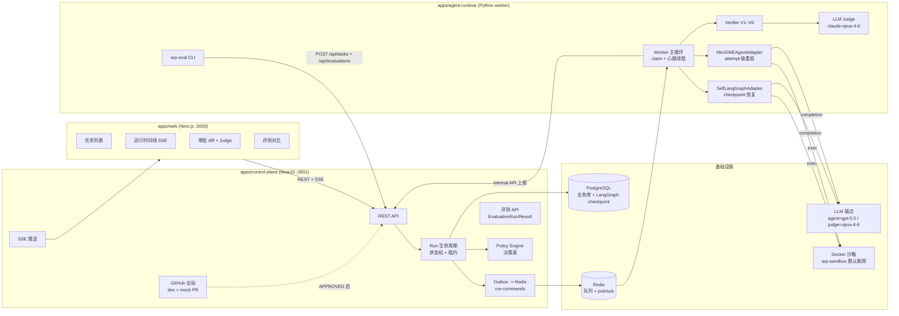
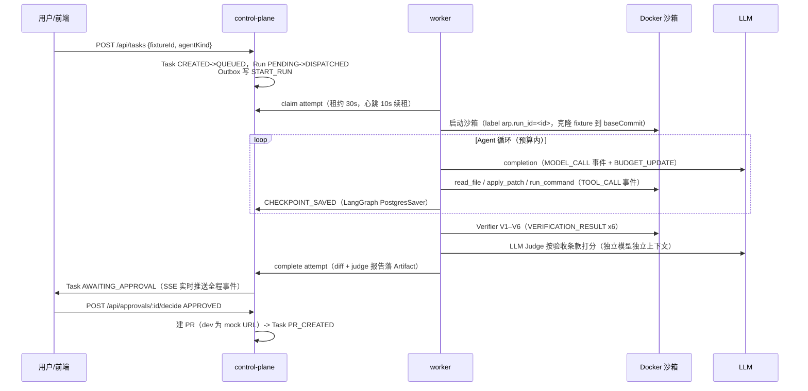
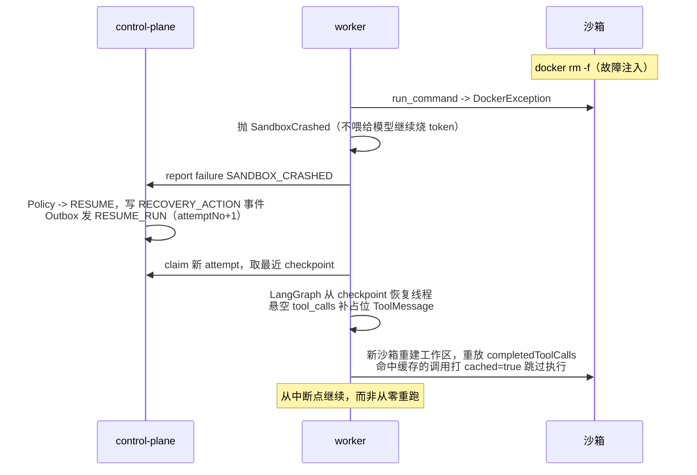

# 架构设计

## 1. 总体架构

角色分工：**控制面只做编排**（状态机、租约、Policy、审批、评测聚合），
**执行面只做干活**（Agent、沙箱、Verifier、Judge），二者只通过 HTTP internal API
和 Redis 队列交互，worker 可随时被杀掉重启。

## 2. 事件流（一次修复任务）

事件一致性：每个 Run 的事件带**严格递增 sequence**（DB 唯一约束 + 事务内分配），
worker 上报带 `idempotencyKey`，重放/重试不产生重复事件。

## 3. 故障恢复

### 3.1 Policy 决策表（节选）

| failureCode | 首次动作 | 重试耗尽 | 说明 |
| --- | --- | --- | --- |
| SANDBOX_CRASHED | RESUME | ESCALATE_HUMAN | 沙箱死亡，从最近 checkpoint 续跑 |
| WORKER_LOST | RESUME | ESCALATE_HUMAN | 租约过期判死，无退避立即恢复 |
| MODEL_RATE_LIMIT | RESUME（退避 30s·2ⁿ） | ESCALATE_HUMAN | 429 归一化，指数退避 |
| VERIFY_TARGET_TESTS_FAILED | RESUME（带失败反馈） | ESCALATE_HUMAN | 结构化反馈进入下一轮 |
| VERIFY_SCOPE_VIOLATION | RESTART_ATTEMPT | ABORT | 越界改动，重开尝试 |
| VERIFY_TEST_TAMPERING | RESTART_ATTEMPT | ABORT | 改测试=作弊，高危 |
| BUDGET_*_EXCEEDED | ESCALATE_HUMAN | — | 预算耗尽直接升级人工 |
| HUMAN_REJECTED | ABORT | — | 人工否决终止 |

评测实验开关：`recoveryDisabled=true` 时 Policy 全部强制 ABORT（消融对照组）；
`feedbackMode=raw` 时 RESUME 反馈只带失败步骤原始输出（对照结构化反馈）。

### 3.2 kill-sandbox 恢复时序

两种 Agent 的恢复粒度不同，评测报告**分组展示、不直接横比**：

| Agent | fineGrainedResume | 恢复方式 |
| --- | --- | --- |
| SELF_LANGGRAPH（自研） | true | checkpoint 级：对话状态 + 工具缓存全量恢复 |
| MINI_SWE（mini-swe-agent） | false | attempt 级：新尝试从零重跑（上游无 checkpoint 概念） |

### 3.3 三种故障注入

| 注入方式 | 触发 | 恢复路径 |
| --- | --- | --- |
| kill-sandbox | e2e/arp-eval 在首个 checkpoint 后 `docker rm -f` | SANDBOX_CRASHED -> RESUME -> checkpoint 续跑 |
| kill-worker | `FAULT_INJECT=kill-worker`（第 2 个 checkpoint 后 `os._exit(137)`）或直接杀进程 | 租约过期 -> WORKER_LOST -> INTERRUPTED -> 新 worker RESUME |
| model-429 | `FAULT_INJECT=model-429`（第 3 次模型调用抛一次 429） | MODEL_RATE_LIMIT -> 退避 RESUME |

## 4. 安全与治理

- **沙箱**：默认 `network=none`，CPU/内存限额，attempt 结束 `docker rm -f`，
  worker 启动清扫 `arp.*` label 孤儿容器；
- **命令白名单**：`run_command` 仅允许 pnpm/npm/node/python/pytest/uv/git status 等前缀，
  denylist 正则拦 curl/wget/ssh/sudo/docker/rm -rf；
- **Verifier V1–V6**：补丁良构 / 范围合规（allowedPaths glob）/ 静态检查 /
  定向测试（fail_to_pass）/ 回归测试（pass_to_pass）/ 测试防篡改（V6 短路提前跑）；
- **LLM Judge 只参考不否决**：独立模型（claude-opus-4-6）独立上下文按
  acceptance_criteria 逐条 0–5 打分，结果进审批页辅助人工决策；
- **人工审批**：AWAITING_APPROVAL -> APPROVED 才触发 PR 创建（dev 为 mock URL）。

## 5. 双端契约

`packages/shared` 同时产出 zod schema（TS）与 JSON Schema（Python 侧 pydantic 校验），
同一批 JSON fixture（run-commands / trace-events）被两端契约测试共同校验，
枚举表做集合比对，保证控制面与执行面的数据契约不漂移。

## 6. 裁剪边界（未生产化项）

| 裁剪项 | 现状 | 生产化方向 |
| --- | --- | --- |
| 鉴权/多租户 | 无鉴权，单 default project | OIDC + RBAC + project 隔离 |
| 队列 | Redis List + Outbox 轮询 | Kafka/NATS，消费组扩展 |
| worker 扩展 | 单 worker 串行 | 多 worker 水平扩展（租约机制已支持） |
| GitHub App | 出站 mock PR；webhook 验签/去重未实装 | 完整 App 安装流 + delivery id 去重 |
| OTel 导出 | compose 预留 jaeger profile | TraceEvent -> OTLP 双写 |
| 沙箱加固 | Docker 默认隔离 | gVisor/Firecracker、seccomp 白名单 |
